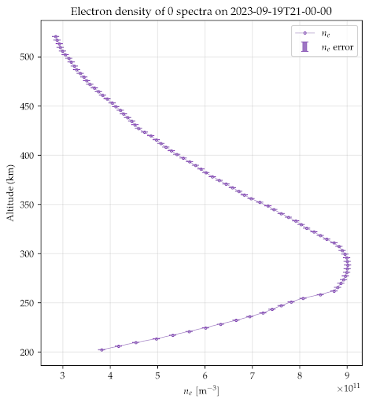
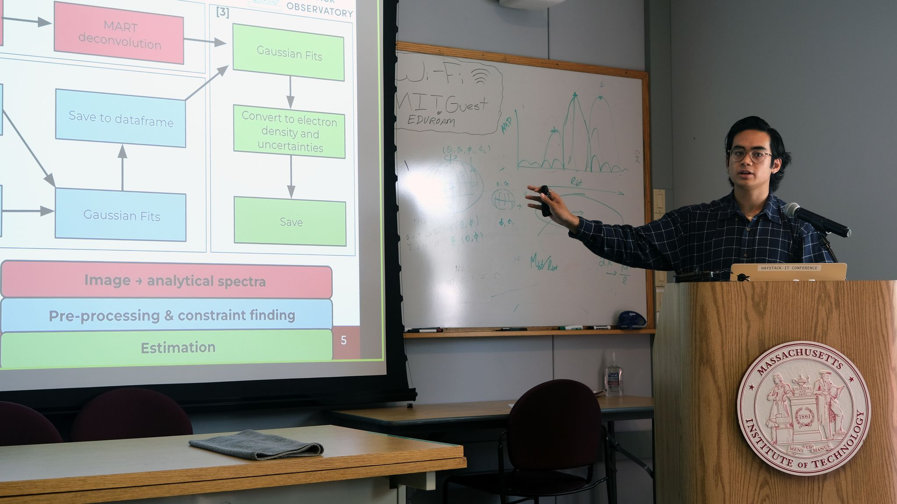
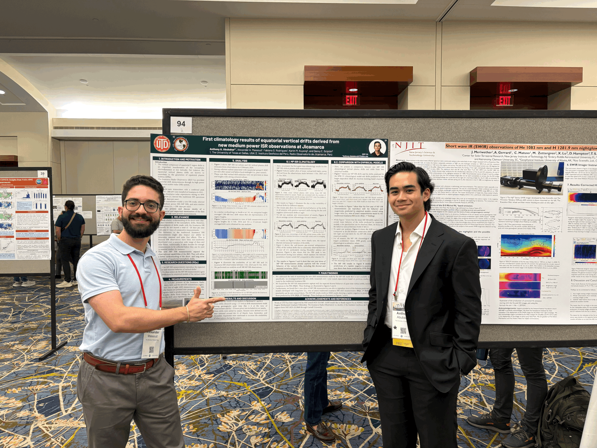
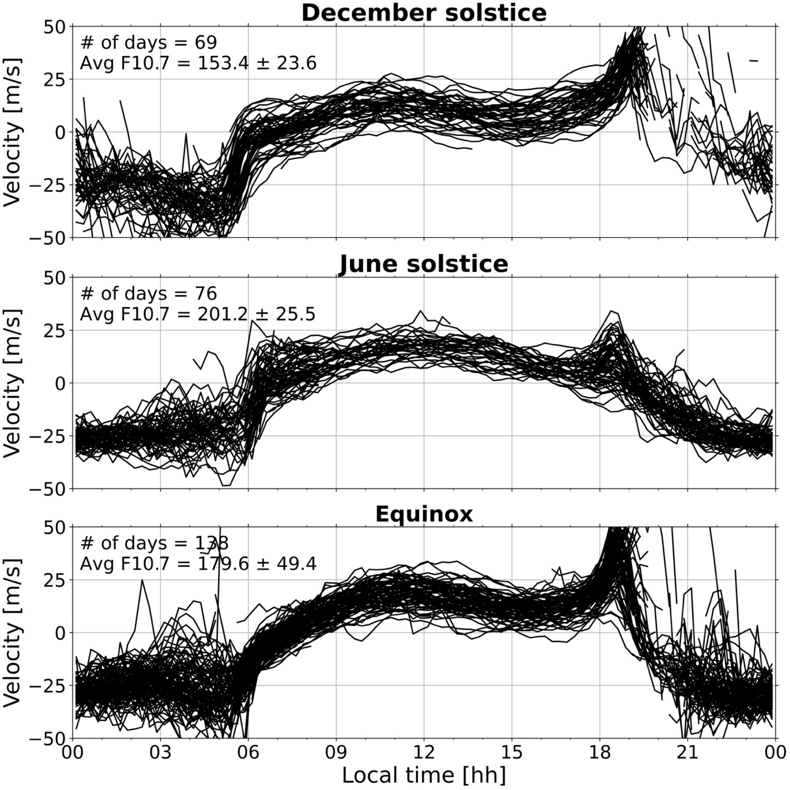

# Research

  
  

### MIT Haystack Observatory — Uncovering ionospheric data from incoherent scatter radar plasma line measurements

At the **MIT Haystack Observatory**, I work on analyzing *plasma line spectra* from the **Millstone Hill Incoherent Scatter Radar (ISR)** to understand ionospheric electron dynamics.  
My research focuses on extracting **electron density and temperature profiles** from radar spectra by using efficient parameter fitting.

This involves developing custom Python pipelines for:
- Signal deconvolution using **MART algorithms**
- Gaussian and Lorentzian curve fitting with **`lmfit`**
- Spectral feature detection using **HDBSCAN** and **Shapely**
- Integration of **IRI-2016** and **PPIGRF** models for geophysical context

---

  
  

### University of Texas at Dallas — Upper Atmosphere Remote Sensing Lab

At the **University of Texas at Dallas**, under the **UARS (Upper Atmosphere Radar Sciences)** group, I work with **ISR data analysis and LWA**.  

This project involved the process of:
- Filtering using quiet-time low-error measurements unaffected by Solar flux
- Data analaysis automation for >300 days of ISR data
- Investigation of ISR data with long-standing machine learning problems

** A paper is in preparation for this project. **

---

Return to [Home](index.html) or go to [Academics](academics.html)
